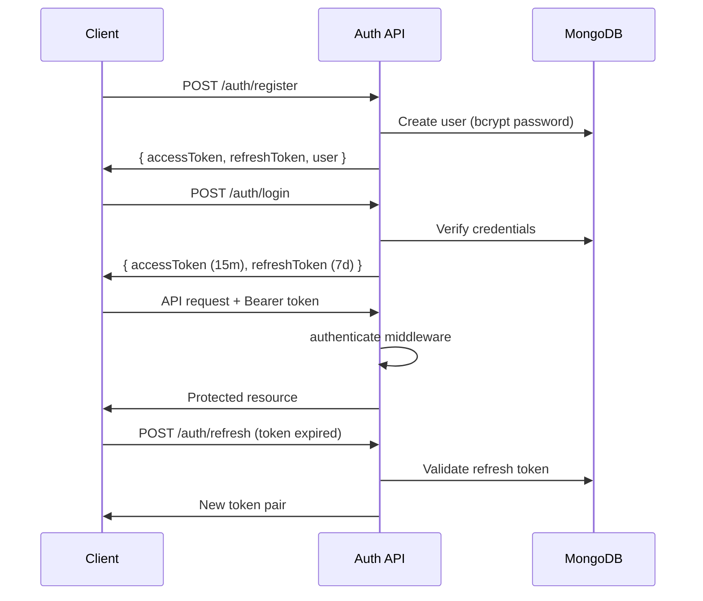
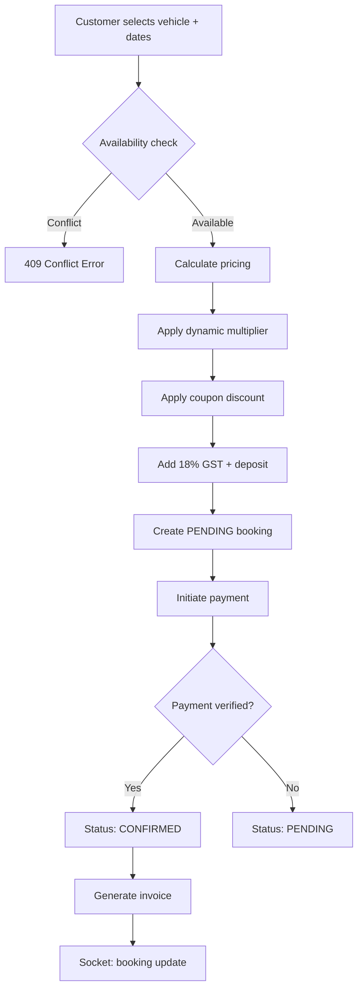

# VelocityRent — Enterprise Vehicle Rental Platform

Premium MERN-stack mobility platform for self-drive **bikes**, **cars**, **EVs**, and **scooters** with real-time booking, GPS tracking, payments, and admin analytics.

---

## Tech Stack

| Layer | Technologies |
|-------|-------------|
| **Frontend** | Next.js 14, React 18, TypeScript, Tailwind CSS, ShadCN UI, Framer Motion, React Query, Zustand, Axios, React Hook Form, Zod |
| **Backend** | Node.js, Express.js, MongoDB, Mongoose, Socket.IO |
| **Auth** | JWT (Access + Refresh), RBAC |
| **Payments** | Razorpay, Stripe |
| **DevOps** | Docker, Docker Compose, Nginx, GitHub Actions CI/CD |

---

## Project Structure

```
Bike_Rent/
├── apps/web/                          # Next.js Customer + Admin Frontend
│   ├── src/
│   │   ├── app/                       # App Router pages
│   │   │   ├── page.tsx               # Landing Page
│   │   │   ├── login/                 # Auth
│   │   │   ├── register/
│   │   │   ├── vehicles/              # Search + Details
│   │   │   ├── booking/checkout/      # Booking Checkout
│   │   │   ├── dashboard/             # Customer Portal
│   │   │   ├── payment/               # Payment Success/Cancel
│   │   │   ├── support/
│   │   │   └── admin/                 # Admin Portal (14 modules)
│   │   ├── components/
│   │   │   ├── ui/                    # ShadCN primitives
│   │   │   ├── layout/                # Navbar, Footer
│   │   │   ├── home/                  # Hero, Features
│   │   │   ├── vehicles/              # VehicleCard, Grid
│   │   │   ├── admin/                 # KPI, Sidebar
│   │   │   └── providers/             # Theme, Query
│   │   ├── hooks/                     # useSocket
│   │   ├── services/                    # API layer (Axios)
│   │   ├── store/                     # Zustand (auth, booking, UI)
│   │   ├── layouts/
│   │   └── utils/
│   └── Dockerfile
│
├── backend/                           # Express API Server
│   ├── src/
│   │   ├── config/                    # App + DB config
│   │   ├── models/                    # 15 MongoDB schemas
│   │   ├── modules/                   # Feature modules
│   │   │   ├── auth/
│   │   │   ├── users/
│   │   │   ├── vehicles/
│   │   │   ├── bookings/
│   │   │   ├── payments/
│   │   │   ├── notifications/
│   │   │   ├── analytics/
│   │   │   ├── support/
│   │   │   ├── maintenance/
│   │   │   ├── gps/
│   │   │   └── coupons/
│   │   ├── middlewares/               # Auth, Validation, Rate Limit, Audit
│   │   ├── routes/                    # API v1 router
│   │   ├── utils/                     # Logger, JWT, Errors, Seed
│   │   ├── app.js
│   │   └── server.js                  # HTTP + Socket.IO
│   └── Dockerfile
│
├── nginx/                             # Reverse proxy
├── .github/workflows/                 # CI/CD pipeline
├── docker-compose.yml
└── .env.example
```

---

## Quick Start

### Prerequisites
- Node.js 20+
- MongoDB 7+
- npm

### 1. Environment Setup

```bash
cp .env.example .env
# Edit .env with your MongoDB URI, JWT secrets, payment keys
```

### 2. Install Dependencies

```bash
npm install
cd backend && npm install
cd ../apps/web && npm install
```

### 3. Seed Database

```bash
cd backend && npm run seed
```

**Demo Credentials:**
| Role | Email | Password |
|------|-------|----------|
| Super Admin | admin@velocityrent.com | Admin@123456 |
| Customer | customer@velocityrent.com | Customer@123 |

### 4. Run Development

```bash
# From root — runs backend + frontend concurrently
npm run dev

# Or separately:
npm run dev:backend   # http://localhost:5000
npm run dev:web       # http://localhost:3000
```

### 5. Docker (Production)

```bash
npm run docker:up
# Frontend: http://localhost:3000
# API: http://localhost:5000
# Nginx: http://localhost:80
```

---

## Architecture

### Backend — Clean Architecture

Each module follows **Controller → Service → Repository** pattern:

```
modules/bookings/
├── booking.controller.js    # HTTP handlers
├── booking.service.js       # Business logic
├── booking.repository.js    # Data access
├── booking.validator.js     # Joi schemas
├── booking.routes.js        # Route definitions
└── booking.engine.js        # Pricing & conflict logic
```

### Authentication Flow



### RBAC Roles

| Role | Access |
|------|--------|
| `super_admin` | Full system access |
| `admin` | Fleet, bookings, analytics, payments |
| `staff` | Bookings, support, maintenance |
| `customer` | Browse, book, profile, support |

### Booking Engine Workflow



**Conflict Prevention:** Overlap query on `startDate/endDate` for active booking statuses.

**Refund Policy:**
- 48+ hours before start → 100%
- 24–48 hours → 75%
- 12–24 hours → 50%
- Under 12 hours → 25%

### Socket.IO Architecture

```
Events (Server → Client):
  notification          → user:{userId}
  booking:update        → booking:{id} + admin room
  gps:location          → vehicle:{id}
  gps:fleet-update      → admin room
  gps:alert             → admin room (overspeed, geofence)
  dashboard:stats       → admin room (every 30s)
  vehicle:availability  → broadcast

Events (Client → Server):
  join:vehicle          → Subscribe to vehicle GPS
  gps:update            → Device telemetry ingest
  booking:subscribe     → Track booking status
```

### REST API (v1)

Base URL: `http://localhost:5000/api/v1`

#### Auth
| Method | Endpoint | Description |
|--------|----------|-------------|
| POST | `/auth/register` | Register customer |
| POST | `/auth/login` | Login |
| POST | `/auth/refresh` | Refresh tokens |
| POST | `/auth/logout` | Logout (auth) |
| GET | `/auth/me` | Current user (auth) |

#### Vehicles
| Method | Endpoint | Description |
|--------|----------|-------------|
| GET | `/vehicles` | List/search (public) |
| GET | `/vehicles/:id` | Vehicle details |
| GET | `/vehicles/:id/availability` | Check dates |
| POST | `/vehicles` | Add vehicle (admin) |
| PUT | `/vehicles/:id` | Edit vehicle (admin) |
| DELETE | `/vehicles/:id` | Soft delete (admin) |

#### Bookings
| Method | Endpoint | Description |
|--------|----------|-------------|
| POST | `/bookings` | Create booking |
| GET | `/bookings` | List bookings |
| GET | `/bookings/:id` | Booking details |
| POST | `/bookings/:id/cancel` | Cancel + refund calc |
| POST | `/bookings/:id/extend` | Extend rental |
| PATCH | `/bookings/:id/status` | Update status (admin) |

#### Payments
| Method | Endpoint | Description |
|--------|----------|-------------|
| POST | `/payments/initiate` | Start Razorpay/Stripe |
| POST | `/payments/verify/razorpay` | Verify Razorpay |
| POST | `/payments/verify/stripe` | Verify Stripe |
| POST | `/payments/:id/refund` | Process refund (admin) |

#### Admin
| Method | Endpoint | Description |
|--------|----------|-------------|
| GET | `/analytics/dashboard` | KPI stats |
| GET | `/analytics/reports` | Revenue/booking reports |
| GET | `/gps/fleet` | Live fleet locations |
| GET | `/users/customers` | Customer list |
| PATCH | `/users/:id/kyc` | KYC verification |

---

## Database Schemas

| Model | Purpose |
|-------|---------|
| **User** | Accounts, KYC, preferences, refresh tokens |
| **Role** | RBAC permissions |
| **Vehicle** | Fleet inventory, pricing, GPS device |
| **VehicleImage** | Vehicle media |
| **Booking** | Reservations with pricing breakdown |
| **BookingHistory** | Audit trail per booking |
| **Payment** | Razorpay/Stripe transactions |
| **Invoice** | Generated invoices |
| **Coupon** | Discount codes |
| **Notification** | User notifications |
| **GPSLog** | Telemetry + geospatial index |
| **Maintenance** | Service records |
| **Review** | Vehicle reviews |
| **SupportTicket** | Help desk tickets |
| **AuditLog** | System audit trail |

---

## Frontend Pages

### Customer Portal
- `/` — Landing page with hero + fleet categories
- `/vehicles` — Search & filter fleet
- `/vehicles/[id]` — Vehicle details + booking
- `/booking/checkout` — Payment checkout
- `/login` · `/register` — Authentication
- `/dashboard` — Customer home
- `/dashboard/bookings` — My bookings
- `/dashboard/profile` — Profile settings
- `/payment/success` · `/payment/cancel`
- `/support` — Support tickets

### Admin Portal (`/admin/*`)
Dashboard · Fleet · Bookings · Customers · KYC · Revenue · Analytics · GPS · Maintenance · Support · Coupons · Notifications · Settings

---

## Security Best Practices

- **Helmet** — HTTP security headers
- **Rate limiting** — API (100/15min), Auth (10/15min), Payments (20/hr)
- **mongo-sanitize** — NoSQL injection prevention
- **bcrypt** — Password hashing (12 rounds)
- **JWT** — Short-lived access tokens + rotating refresh tokens
- **CORS** — Origin whitelist
- **Input validation** — Joi schemas on all endpoints
- **RBAC middleware** — Role-based route protection
- **Audit logging** — Admin action tracking
- **Soft deletes** — Vehicles deactivated, not removed

---

## Deployment Architecture

```
                    ┌─────────────┐
                    │   Nginx     │ :80/:443
                    │  (Reverse   │
                    │   Proxy)    │
                    └──────┬──────┘
                           │
              ┌────────────┼────────────┐
              │                         │
       ┌──────▼──────┐          ┌──────▼──────┐
       │  Next.js    │          │  Express    │
       │  (Web)      │          │  (API)      │
       │  :3000      │          │  :5000      │
       └─────────────┘          └──────┬──────┘
                                       │
                              ┌────────┼────────┐
                              │                 │
                       ┌──────▼──────┐  ┌──────▼──────┐
                       │  MongoDB    │  │   Redis     │
                       │  :27017     │  │   :6379     │
                       └─────────────┘  └─────────────┘
```

---

## Design System

- **Colors:** Black/White base, Electric Blue (`#007BFF`), Neon Green (`#39FF14`)
- **Fonts:** Inter (body), Poppins (display), Montserrat (headings)
- **Effects:** Glassmorphism, soft shadows, gradient accents
- **Themes:** Dark/Light via `next-themes`

---

## License

Proprietary — VelocityRent Platform
